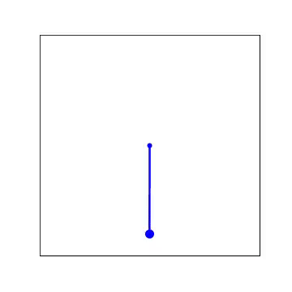
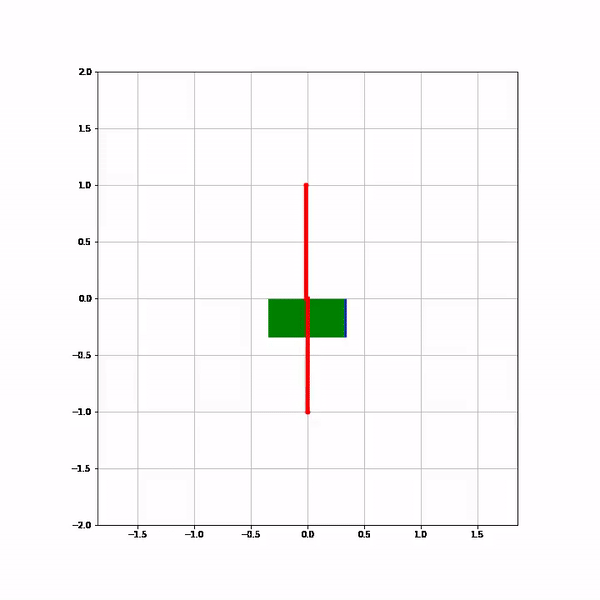
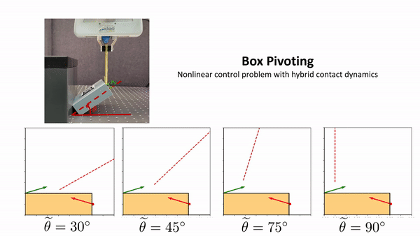

I am a Ph.D. student at the École polytechnique fédérale de Lausanne ([EPFL](https://www.epfl.ch/en/)) and a research assistant at the [Idiap Research Institute](https://www.idiap.ch/en). I am doing my research at Robot Learning and Interaction group (RLI) under the supervision of [Dr.Sylvain Calinon](https://calinon.ch/).  

My research in robotics lies at the intersection of data-efficient machine learning and control engineering. In particular, using **low-rank tensor approximation techniques** I am developing algorithms for Robot Control, Reinforcement Learning, and Motion Planning that were previously considered to be intractable. 

If you are curious about my research, checkout my [previous work]((https://sites.google.com/view/ttgo/home)) which proposes a new methodology for global optimization of non-convex functions encountered in robotics. In my latest work, this is being used to develop optimal control techniques for robotic systems (including those having discontinuities arising from contact) which outperforms existing reinforcement learning algorithms for some commonly encountered tasks in robotics. 

## What is low-rank tensor approximation?
Low-rank tensor appoximation techniques (aka Tensor Networks in applied physics) are powerful function approximation techniques heavily used in physics computing including quantum computing. They are particularly interesting for robotics as they are highly interpretable and  allow efficient algebraic operations to be performed on them. Furthermore, they are much more efficient and accurate for many commonly encountered applications in robotics. See my publication list for details.  

## What can you do with tensor approximation?
### Motion Planning:

### Control of highly nonlinear and discontinuous systems:
| Pendulum Swingup | Cart-Pole Swingup | 
| ------------------- | ------------------- |
|  | |

| Planar Pushing | Experiment | 
| ------------------- | ------------------- |

|  |  |

## Latest News
### 2023
- [June - September] I will be doing summer internship at [Disney Research Studios, Zurich](https://studios.disneyresearch.com/). 

- Workshop paper "Dynamic Programming using Tensor Approximation for Contact-rich Manipulation" is presented in [ICRA-2023](https://sites.google.com/view/icra2023embracingcontacts/home?pli=1) 
  - [workshop paper](https://openreview.net/pdf?id=nhiMzuaPoP)
  - The main paper will be released soon (watchout for some cool results where we outperform RL algorithms on some highly challenging control tasks)

### 2022
- Our paper "Tensor Train for Global Optimization Problems in Robotics" is out on arXiv 
  - [Website](https://sites.google.com/view/ttgo/home)

### 2021
- Our paper "Ergodic Exploration using Tensor Train: Applications in Insertion task" won the institute's  **best paper award** of the year (2021) from the Idiap Research Institute.

- Our paper "Trajectory Prediction with Compressed 3D Environment Representation using Tensor Train Decomposition" is accepted at ICAR. 

- Our paper "Ergodic Exploration using Tensor Train: Applications in Insertion task" is accepted for publication at **IEEE Transactions on Robotics**.
  - [Website](https://sites.google.com/view/ergodic-exploration/)

### 2019
- (June) Started my **PhD at EPFL** and as a Research Assistent at **Idiap Research Institute, Martigny**.

- (Feb) Joined Robert Bosch Center for Cyber-Physical systems as a Research Associate
  - I will be applying **Reinforcement Learning** to generate walking gaits for a quadruped called Stoc which is developed in-house.

### 2016
- Started working at **The MathWorks Inc, India** in the Engineering Development Group
  - I will be working with MATLAB, Simulink, Robotics System Toolbox, Automated Driving System Toolbox.

### 2014
- Started a master's degree in Mechanical Engineering at the **Indian Institute of Science, Bangalore**
  - I will be focusing on **Dynamic Systems and Control**.
